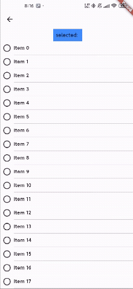

# Drag Selectable ListView

A Flutter ListView that supports drag-to-select multiple items with customizable selection UI and smooth interaction.

## Features

✨ **Drag Selection**: Select multiple items by dragging across them\
🎨 **Customizable UI**: Custom checkbox builders and item layouts\
📱 **Lazy Loading**: Uses ListView.builder for efficient rendering\
🎯 **Flexible Selection**: Support for both tap and drag selection modes\
🔧 **Easy Integration**: Simple API that works with existing ListView patterns

## Demo



## Getting Started

### Installation

Add this to your package's `pubspec.yaml` file:

```yaml
dependencies:
  drag_selectable_listview: ^0.0.1
```

Then run:

```bash
flutter pub get
```


## Complete Example

Here's a complete working example showing how to use DragSelectableListView:

```dart
class DragSelectPage extends StatefulWidget {
  const DragSelectPage({super.key});

  @override
  State<DragSelectPage> createState() => _DragSelectPageState();
}

class _DragSelectPageState extends State<DragSelectPage> {
  Set<int> selected = {};

  @override
  Widget build(BuildContext context) {
    return Scaffold(
      appBar: AppBar(),
      body: Column(
        children: [
          Container(
            color: Colors.blueAccent,
            padding: EdgeInsets.all(8),
            child: Text(
              'selected: ${selected.toList().join(', ')}',
              maxLines: 1,
              overflow: TextOverflow.ellipsis,
            ),
          ),
          Expanded(
            child: DragSelectableListView(
              itemCount: 60,
              itemHeight: 40,
              checkboxWidth: 40,
              itemBuilder: (context, index) {
                return Expanded(
                  child: GestureDetector(
                    onTap: () {
                      print(index);
                    },
                    child: Column(
                      crossAxisAlignment: CrossAxisAlignment.start,
                      children: [
                        Expanded(
                          flex: 1,
                          child: Column(
                            mainAxisAlignment: MainAxisAlignment.center,
                            children: [Text("Item $index")],
                          ),
                        ),
                        Divider(height: 1),
                      ],
                    ),
                  ),
                );
              },
              checkboxBuilder:
                  ({
                    required bool value,
                    required ValueChanged<bool?> onChanged,
                  }) {
                    return Transform.scale(
                      scale: 1.2,
                      child: Checkbox(
                        shape: RoundedRectangleBorder(
                          borderRadius: BorderRadius.circular(10.0),
                        ),
                        value: value,
                        onChanged: onChanged,
                      ),
                    );
                  },
              selected: selected,
              onSelectionChanged: (e) {
                setState(() {
                  selected = e;
                });
                print(selected);
              },
            ),
          ),
        ],
      ),
    );
  }
}
```

## API Reference

### Properties

- **itemCount** (int): Total number of items in the list
- **itemBuilder** (IndexedWidgetBuilder): Builder function for list items
- **selected** (Set<int>): Set of currently selected item indices
- **onSelectionChanged** (ValueChanged<Set<int>>): Callback when selection changes
- **checkboxBuilder** (Function): Builder for custom checkbox widgets
- **itemHeight** (double): Height of each list item
- **checkboxWidth** (double): Width allocated for checkbox area

### Selection Behavior

- **Tap Selection**: Tap individual checkboxes to toggle selection
- **Drag Selection**: Press and drag across items to select/deselect ranges
- **Selection Toggle**: Drag selection toggles items (selected ↔ deselected)
- **Visual Feedback**: Selection changes are immediately reflected in the UI

## Examples

### Contact List Example

```dart
class ContactList extends StatefulWidget {
  @override
  _ContactListState createState() => _ContactListState();
}

class _ContactListState extends State<ContactList> {
  Set<int> selectedContacts = {};
  List<Contact> contacts = [/* your contacts */];

  @override
  Widget build(BuildContext context) {
    return Column(
      children: [
        Text('Selected: ${selectedContacts.length} contacts'),
        Expanded(
          child: DragSelectableListView(
            itemCount: contacts.length,
            selected: selectedContacts,
            itemHeight: 72.0,
            checkboxWidth: 56.0,
            itemBuilder: (context, index) {
              final contact = contacts[index];
              return ListTile(
                leading: CircleAvatar(
                  child: Text(contact.name[0]),
                ),
                title: Text(contact.name),
                subtitle: Text(contact.email),
              );
            },
            checkboxBuilder: ({
              required bool value,
              required ValueChanged<bool?> onChanged,
            }) {
              return Checkbox(
                value: value,
                onChanged: onChanged,
              );
            },
            onSelectionChanged: (newSelection) {
              setState(() {
                selectedContacts = newSelection;
              });
            },
          ),
        ),
      ],
    );
  }
}
```

## Performance

### Current Optimizations

✅ **Lazy Loading**: Uses `ListView.builder` for efficient memory usage\
✅ **Efficient Scrolling**: Proper scroll controller management\
✅ **Minimal Rebuilds**: Targeted widget updates

### Performance Considerations

For optimal performance with large lists:

```dart
// Good: Use const constructors for static content
itemBuilder: (context, index) {
  return const MyListItemWidget(); // If possible
}

// Good: Provide explicit item heights
itemHeight: 56.0, // Avoids layout calculations

// Consider: Use RepaintBoundary for complex items
itemBuilder: (context, index) {
  return RepaintBoundary(
    child: MyComplexItemWidget(),
  );
}
```

### Future Optimizations

Potential improvements for future versions:
- RepaintBoundary integration for complex items
- AutomaticKeepAlive for state preservation
- Selection change batching for smoother drag operations
- Item caching mechanisms

## Testing

This package includes comprehensive tests covering:

- Widget rendering and layout
- Selection state management
- Drag gesture handling
- Custom UI components
- Edge cases and boundary conditions

Run tests with:

```bash
flutter test
```

See [TESTING.md](TESTING.md) for detailed test documentation.

## Contributing

We welcome contributions! Please follow these steps:

1. Fork the repository
2. Create a feature branch (`git checkout -b feature/amazing-feature`)
3. Commit your changes (`git commit -m 'Add amazing feature'`)
4. Push to the branch (`git push origin feature/amazing-feature`)
5. Open a Pull Request

### Bug Reports

Please file bug reports with:
- Clear description of the issue
- Steps to reproduce
- Expected vs actual behavior
- Flutter version and device information

## License

This project is licensed under the MIT License - see the [LICENSE](LICENSE) file for details.

## Changelog

### 0.0.1
- Initial release
- Basic drag selection functionality
- Custom checkbox support
- Configurable dimensions

## Support

If you have any questions or need help, please open an issue on GitHub.

---

Made with ❤️ by the Flutter community